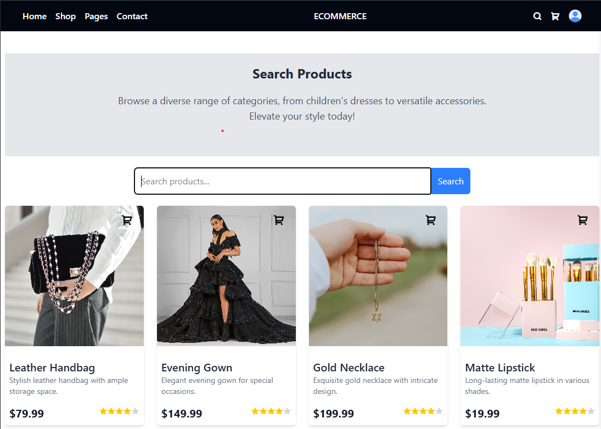
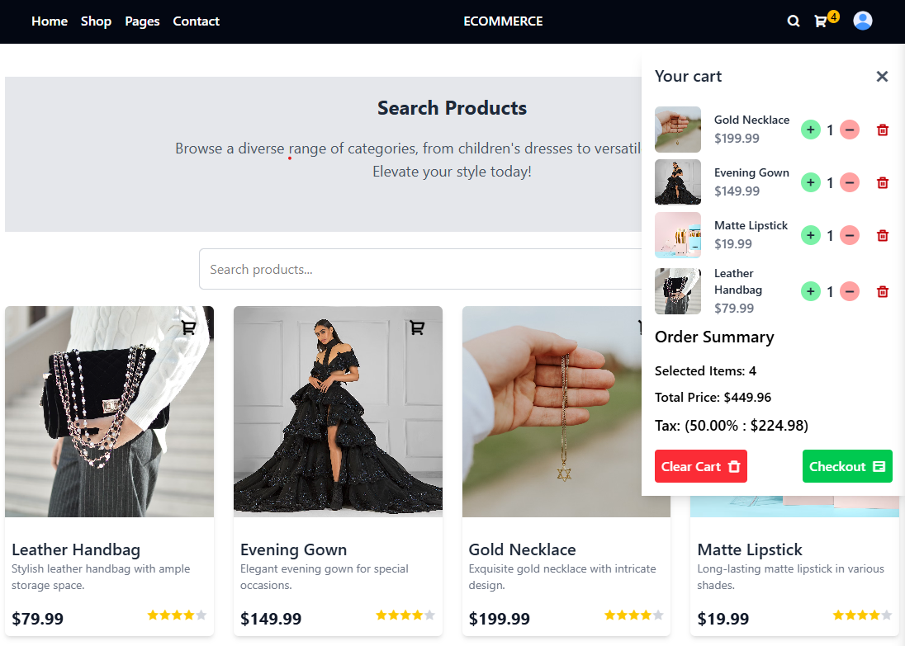

# E-Commerce MERN Stack Application

## Table of Contents

-   [Overview](#overview)
-   [Features](#features)
-   [Technologies Used](#technologies-used)
-   [Installation](#installation)
-   [Running the Application](#running-the-application)
-   [Environment Variables](#environment-variables)
-   [Folder Structure](#folder-structure)
-   [API Endpoints](#api-endpoints)
-   [Screenshots](#screenshots)
-   [Contributing](#contributing)
-   [License](#license)

## Overview

This is a full-stack e-commerce web application built using the MERN stack (MongoDB, Express.js, React.js, and Node.js). The application is divided into two parts:

1. **Frontend** (React + Redux + TailwindCSS)
2. **Backend** (Express.js + MongoDB + JWT Authentication)

It includes user authentication, product management, filtering, cart functionality, and a secure Stripe payment system. Admins have exclusive access to manage products.

## Features

✅ Dynamic Navigation & Routing  
✅ Product Searching & Filtering (Category, Color, Price)  
✅ Shopping Cart Functionality  
✅ User Authentication (Login/Logout) using JWT  
✅ Image Upload with Cloudinary  
✅ Secure Stripe Payment Integration  
✅ Admin Panel for Managing Products  
✅ Responsive UI with TailwindCSS

## Technologies Used

### Frontend:

-   React.js
-   Redux Toolkit (RTK Query)
-   TailwindCSS

### Backend:

-   Node.js
-   Express.js
-   MongoDB (Mongoose ODM)
-   JWT Authentication
-   Cloudinary for Image Storage
-   Stripe for Payment Processing

## Installation

### Prerequisites:

-   Node.js (>=16.x)
-   MongoDB (local or Atlas)
-   Cloudinary Account (for image storage)
-   Stripe Account (for payments)

### Clone the Repository:

```sh
git clone https://github.com/your-username/ecommerce-mern.git
cd ecommerce-mern
```

## Running the Application

### Backend:

1. Navigate to the backend folder:
    ```sh
    cd backend
    ```
2. Install dependencies:
    ```sh
    npm install
    ```
3. Start the server:
    ```sh
    npm run start
    ```

### Frontend:

1. Navigate to the frontend folder:
    ```sh
    cd frontend
    ```
2. Install dependencies:
    ```sh
    npm install
    ```
3. Start the development server:
    ```sh
    npm run dev
    ```

The application should now be running on `http://localhost:5173` (or another available port).

## Environment Variables

Create a `.env` file in both `frontend` and `backend` folders and add the following:

### Backend (`.env`):

```
PORT=5000
MONGO_URI=your_mongodb_connection_string
JWT_SECRET=your_secret_key
CLOUDINARY_CLOUD_NAME=your_cloud_name
CLOUDINARY_API_KEY=your_api_key
CLOUDINARY_API_SECRET=your_api_secret
STRIPE_SECRET_KEY=your_stripe_secret_key
```

### Frontend (`.env`):

```
VITE_API_BASE_URL=http://localhost:5000
VITE_STRIPE_PUBLISHABLE_KEY=your_stripe_publishable_key
```

## Folder Structure

```
/📦 project-root/
├── 📂 frontend/                     # Frontend (React) application
│   ├── 📂 public/                   # Public assets
│   ├── 📂 src/                      # Main source code
│   │   ├── 📂 assets/               # Static assets (images, fonts, etc.)
│   │   ├── 📂 components/           # Reusable UI components
│   │   │   ├── Footer.jsx
│   │   │   ├── Login.jsx
│   │   │   ├── Navbar.jsx
│   │   │   ├── Register.jsx
│   │   ├── 📂 data/                  # Data or mock files (if any)
│   │   ├── 📂 pages/                 # Page components
│   │   │   ├── 📂 blogs/
│   │   │   ├── 📂 category/
│   │   │   ├── 📂 home/
│   │   │   ├── 📂 not-found/
│   │   │   ├── 📂 search/
│   │   │   ├── 📂 shop/
│   │   │   │   ├── 📂 productDetails/
│   │   │   │   ├── 📂 reviews/
│   │   │   │   ├── CartModal.jsx
│   │   │   │   ├── OrderSummary.jsx
│   │   │   │   ├── ProductCards.jsx
│   │   │   │   ├── RatingStars.jsx
│   │   │   │   ├── ShopFiltering.jsx
│   │   │   │   ├── ShopPage.jsx
│   │   │   │   ├── TrendingProducts.jsx
│   │   ├── 📂 redux/                 # Redux state management
│   │   │   ├── 📂 features/          # Feature slices
│   │   │   │   ├── auth/
│   │   │   │   ├── cart/
│   │   │   │   ├── products/
│   │   │   │   ├── reviews/
│   │   │   ├── store.js              # Redux store configuration
│   │   ├── 📂 routers/               # Routing logic (if applicable)
│   │   ├── 📂 utils/                 # Utility functions
│   │   ├── App.css
│   │   ├── App.jsx
│   │   ├── index.css
│   │   ├── main.jsx
│   ├── package.json
│   ├── package-lock.json
│   ├── .gitignore
│
├── 📂 backend/                       # Backend (Node.js + Express) application
│   ├── 📂 src/                       # Main backend source code
│   │   ├── 📂 middleware/            # Middleware for authentication & authorization
│   │   │   ├── generateToken.js
│   │   │   ├── verifyAdmin.js
│   │   │   ├── verifyToken.js
│   │   ├── 📂 products/              # Product-related backend logic
│   │   │   ├── products.model.js
│   │   │   ├── products.route.js
│   │   ├── 📂 reviews/               # Review-related backend logic
│   │   │   ├── reviews.model.js
│   │   │   ├── reviews.router.js
│   │   ├── 📂 users/                 # User-related backend logic
│   │   │   ├── user.model.js
│   │   │   ├── user.route.js
│   ├── .env                          # Environment variables
│   ├── index.js                      # Backend entry point
│   ├── package.json
│   ├── package-lock.json
│   ├── .gitignore
│
└── README.md                         # Documentation file
      # Project documentation
```

## API Endpoints

### Authentication

-   `POST /api/auth/register` - Register a new user
-   `POST /api/auth/login` - Login a user
-   `GET /api/auth/profile` - Get user profile (protected route)

### Products

-   `GET /api/products` - Fetch all products
-   `POST /api/products` - Add new product (Admin only)
-   `PUT /api/products/:id` - Update product (Admin only)
-   `DELETE /api/products/:id` - Delete product (Admin only)

### Cart

-   `POST /api/cart/add` - Add product to cart
-   `GET /api/cart` - Get cart items

### Orders

-   `POST /api/orders` - Create a new order
-   `GET /api/orders/user` - Get user orders
-   `GET /api/orders/admin` - Get all orders (Admin only)

## Screenshots





## Contributing

Feel free to fork this repository and submit pull requests. All contributions are welcome!
